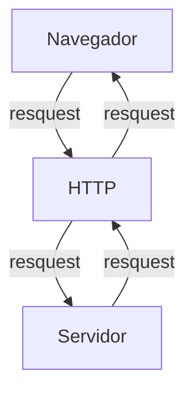
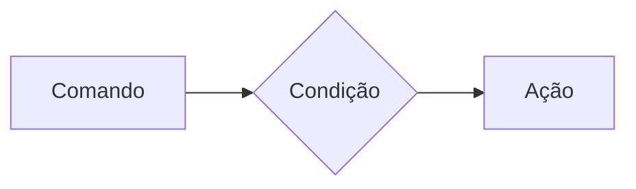
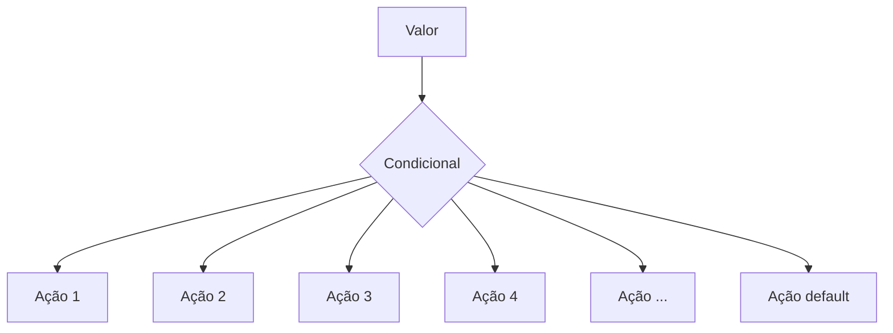
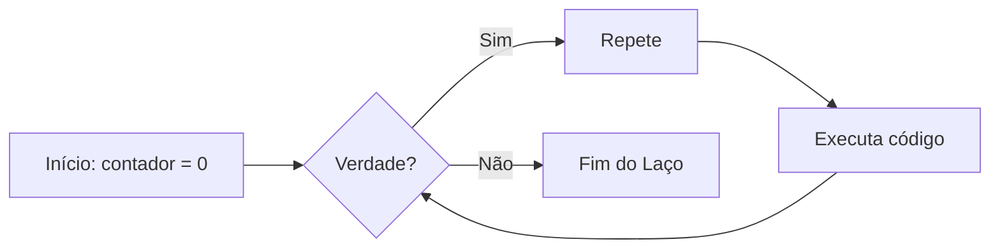
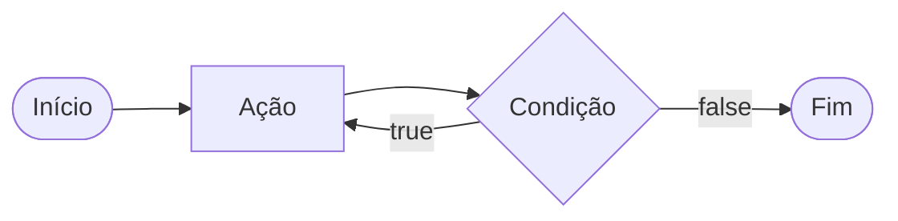
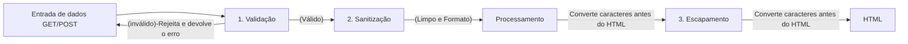
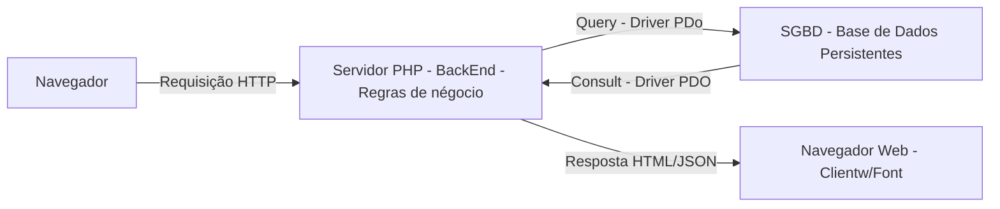
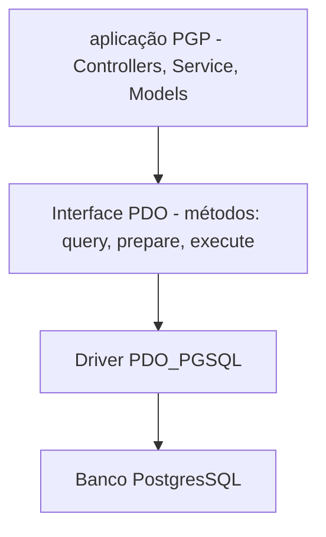

# Curso BackEnd - 225h - Técnico em Desenvolvimento de sistemas - SENAI
29/07/2026
---

Profº Diogo TB

Escola SENAI Americana

2º Semestre 2025

## Objetivos do Curso

- Desenvolver Aplicações web Server Side, utilizando a linguagem PHP;
- Aplicar Sintaxe Nativa PHP (Vanilla);
- Manipulação HTTP;
- Persistência de Dados;
- Segurança contra SQL Injection/CSRF;
- Refatoração em POO (Programação Orientada ao Objeto);
- Arquitetura MVC (Model, View, Controller);
- Utilização do FrameWork Laravel; 

Obs: framework - um conjunto de bibliotecas que oferecem uma solução completa para o desinvolvimento de alguma coisa.

## Cronograma do Semestre

Carga Horária: 1º Semestre 105h e 2º Semestre 120h

Duração: 20 Semanas 1º Semestre e 20 Semanas 2º Semestre

---

### Semana 1: Introdução ao BackEnd e Configuração do Ambiente PHP

#### O que é BackEnd?
 
 O back-end é a parte de uma aplicação que o usuário não vê, mas que faz tudo funcionar por trás das telas.

O Back-End é a parte de um sistema que funciona nos servidores, sendo responsável por executar a lógica da aplicação, processar informações e armazenar dados. 

Além disso, o BackEnd é responsável por atender ás solicitações do Frontend.

Sobre o mercado atual:o cenário é bom, mas mais exigente do que era. Quem conhece só o básico enfrenta mais concorrência. Quem alia backend sólido com IA aplicada, cloud e inglês está num patamar completamente diferente 
vagas internacionais remotas são uma realidade pra esse perfil.

O Backend é formado pelo servidor, banco de dados, lógica de programação com APIs e linguagens de programação/frameworks. Esses componentes trabalham juntos para processar dados, armazenar informações e garantir o funcionamento da aplicação.

# Para que serve
-Processar lógica de negócio: regras, cálculos, validações (ex: calcular frete, aplicar desconto, validar login)

-Gerenciar banco de dados: salvar, buscar, atualizar e deletar informações

-Autenticação e autorização: controlar quem pode acessar o quê (login, senhas, permissões)

-Fornecer APIs: criar "pontes" (endpoints) para o frontend ou outros sistemas consumirem dados

-Integração com serviços externos: pagamentos, e-mails, notificações, APIs de terceiros

-Segurança: proteger dados sensíveis, evitar ataques (SQL injection, XSS, etc.)

-Escalabilidade e performance: garantir que o sistema aguente muitos usuários ao mesmo tempo.


# Principais Tecnologias Linguagens de programação: 
 Ferramentas usadas para escrever o código do servidor, como Python, Node.js (JavaScript), Java e PHP.APIs: Os "caminhos" que permitem que o que você vê no celular converse com o servidor.


 Fintechs e Bancos
Segurança, transações, alta escala 

E-commerce
Catálogo, pedidos, pagamentos

Healthtechs
Prontuários, telemedicina

SaaS / Startups
Backend é o coração do produto

Logística
Rastreio, rotas, tempo real

Educação
Plataformas, conteúdo, usuários

#### O Ciclo de vida da Requisição HTTP

#### O que é HTTP?
**HTTP**, Hypertext Transfer Protocol, é um protocolo de comunicação utilizado para transferencia de informações na WWWW (World Wide Web) e em outros sistemas de redes.

O HTTP é a base para que o cliente e um servidor web troquem de informações. Ele permite a requisição e a respostas de recursos como, imagens, arquivos e textos.


---
## Como funciona na Prática o BackEnd

- **Ação do Usuário:** Envia uma solicitação pela UI (Interface do Usuário/ User Interface). 
> Exemplo de UI:
`-Tela do celular;`
`- Navegador da internet;`
`- Alexa;`
`-IOT.`
- **Enviar uma Requisição:** A UI transoforma a ação do Usuário em uma requisição HTTP.
-**O processamento BackEnd:** O código BackEnd recebe o pedido, válida os dados e decide o que fazer. 
>`Ex: Consultar uma informação no BD (Banco de Dados)`.

-**Respostas:** O servidor devolve o resultado para a UI. 
>`Ex: Um login autorizado, Confirmação de compra,..`

#### Tipos de Requisisão HTTP

Os tipos de requisição HTTP indicam a ação que o usuário deseja executar no servidor.
As principais são:

-**Get:**
> Pede dados de um lugar especifico do servidor. "Não faz alterações no servidor".

-**Delete:**
> Apaga um dado do servidor.

-**Post:**
> Envia dados novos para *criar* algo ou processar informações no servidor.

-**Put/Patch:**
> Modifica um dado já existente
---
>`Put: Muda os dados de forma integralmente/completa`

>`Patch: Muda os dados de forma parcial`
---
#### Iniciando o PHP 

**PHP** (HyperText PreProcessor) é uma linguagem de programação interpretada e open source, focada no desenvolvimento de sistemas para WEB, e pode ser usada junto com HTML para a criação de páginas web dinãmicas.

O PHP de fato é uma das linguagens de programação mais populares da atualidade. Ela permite que você crie aplicações WEB robustas, de uma maneira muito mais simplificada e direta. A linguagem tem diversos recursos que facilitam e aceleram o `processo de desenvolvimento de sites e sistemas para a web. E além do mais, ela ainda tem um ótimo ecossistema, uma excelente comunidade e um grande mercado de trabalho.

---
#### Instalando o PHP

- Fazer o Download do PHP (php.net)
- ZIP - NTS (Non Thread Safe) 8.5
- Descompactar o Arquivo do PHP na pasta C:\src\php (para descompactar, usar o ZIP7 --> Melhor) --> nunca salvar arquivos ou programas na raiz do sistema (C:)
- Adicionar a Pasta do PHP (C:\src\php) as variáveis de Ambiente do sistema (PATH)
- Verificar a instalação rodando o comando:
```bash
php --version
```
---
Para acessar a página PHP, usar o comando no terminal:
```Bash
php -S localhost:8080
```
---
#### Semana 2 - Varíáveis e constantes e operadores em PHP
#### Criando Minha Primeira Aplicação em PHP

>1.0 Antes de começar a Codar:

* Preparar meu VSCODE
* Criar um profile próprio para PHP
* Instalar Extensões Necessárias para transformar o meu VSCODE em uma IDE
    - PHP Intelephense -> **Permite a utilização de Snippets (atalhos de código)**
    - PHP Debug -> **Ajuda a encontrar erros de código**
    - PHP Cs Fixer -> **Formatação de códigco (identação)**
    - PHP Server -> **Ajuda na criação de um servidor local para PHP**
* Desabilitamos o PHP nativo do VSCODE (@bultinPHP)

>2.0 Hello World (Muito Importante!)

#### Estudo de Variáveis e Constantes em PHP

Declarar variáveis é alocar um espaço na memória que permite a inclusão e manipulação de dados.
 
 **Variáveis**

 - Devem ser declaradas usando um "$" antes do nome da variável
 - São não tipadas (Não precisa declarar o tipo dela na criação)
 - Podem ser String, Numéricas (Int e Float), Booleanas e Nulas. Não permite declaração de Undefined

 >REGRA DE OURO: Usar o "declare(Strict_types=1);" na primeira linha do arquivo -> blinda o sistema contra conflitos de tipos de variáveis

 **Constantes**
 - Não podem ser mudadas ou redeclaradas após a criação
 - Pode ser criada usando "const" ou "define"
 - Não permite interpolação

#### Estudo de Operadores

**Aritméticos**: São usados para realizar cálculos

| Operador | Nome | Exemplo | Resultado |
| - | - | - | - |
| + | Adição | 10+5 | 15 |
| - | Subtração | 10-5 | 5 |
| * | Multiplicação | 10*5 | 50
| / | Divisão | 10/5 | 2 | 
| % | Modulo(resto) |10%3| 1 (10 div 3 da 3, e sobra **1**)
|**| Expoente | 2**3| 8 (2 elevado a 3)

**Relacionais**: Permite o relacionamento entre dois ou mais valores, o resulado de uma operação é sempre uma booleana (Verdadeiro ou Falso).

| Operador | Significado | Exemplo | Resultado |
| - | - | - | - |
| > | Maior que | 18 > 18 | false |
| < | Menor que | 10 > 20 | true | 
| >= | Maior ou igual a | 18 > 18 | true |
| <= | Menor ou igual a | 10 <= 5 | false |
| ==| Comparação de valor | "10"==10 | true |
| === | Comparação estrita | "10"===10 | false |
|!=| Diferente | "10"!10| false |
| !== | Estritamente diferente | "10"!==10| true |

**Lógicos**:
Permite a combinação entre sentenças

- Operador AND (E) -> &&: para o resultado ser verdadeiro, todas as combinações precisam ser verdadeiras
    - true && true => true
    - true && false => false

- Operador OR (OU) -> ||: para o resultado ser verdadeiro, basta apenas uma condição ser verdadeira
    -false || true => true
    -false || false => false

- Operador NOT (NÃO) => !: Inverte a lógica da operação
    - !true => false
    - !false => true

--- 
### Semana 3  Estrutura de dados (Condicionais e repetição)

- **Conteúdo**:
 Estrutura 
 operdadores ternários ->`if`,`else`,`elseif` 
substituto do switch/case -> `match` 
loops -> `for`,`while`,`do-while`,`forach`

## Estruturas de controle de dados ajudam no processo de automatização em programas e sistemas

### Condiciomais (IF,ELSE,ELSEIF)

**Formas de uso**

- uso do `if`apenas:
Exemplo: aplicar desconto de 10% em compras acima de 100 reais.


---
```php
if($valorCompra > 100){
    $valorFinal = $valorCompra * 0.9;
}
```

- Uso do `if` e do `else`
Exemplo: Aplicar um desconto de 10% para compras acima de 100 reais e 5% paraa as demais compras
 
 ```mermaid
 graph LR
 A[Comando] --> B{Condição}
 B --> |true| C[Ação 1]
 B --> |false| D[Ação 2]
 ``` 
 
 ```php
 if ($valorCompra > 100){
    $valorFinal = $valorCompra * 0.9;
 } else {
    $valorFinaç = $valorCompra * 0.95;
 }
 ```

 - Uso `elseif` (if encadeado) -> estrutura usada para manipulação de dados em duas ou mais condicionais.
 Exemplo: compras acima de 200 reais tem 15% de desconto, compras de acima 100 reais tem 10% de desconto e demais compras tem 5% de desconto.
 
 ```mermaid
graph LR

A[Comando] --> B{Condição 1}
B --> |true| C[Ação 1]
B --> |false| D{Condição 2}
D --> |true| E[Ação 2]
D --> |false| F[Ação 3]
```

```php
if ($valorcompra > 200) {
    $valorFinal = $valorCompra * 0.85;
} elseif ($valorCompra > 100) {
    $valorfinal = $valorcompra * 0.9;
} else {
    $valorFinal = $valorCompra * 0.95;
}
```

**OBSERVAÇÃO**: sempre usar `elseif` para situações que precisam de mais de uma condição, ou seja, fazer encadeamento das condições

- Uso *ERRADO* do if:

```php
if ($valorcompra > 200) {
    $valorFinal = $valorCompra * 0.85;
} 
if ($valorCompra > 100) {
    $valorfinal = $valorcompra * 0.9;
} else {
    $valorFinal = $valorCompra * 0.95;
}
```
#### Operadores ternários:
Um atalho para a estrutura condicional `if/else`, normalmente escrita em uma única linha de código.

`condição? verdadeira: falsa`

Perfeito para descisões curtas de uma linha de comando
Exemplo: Verficar se a pessoa é maior de idade (18)
 
 ```php
 $idade = 18;
 // O formato é (condição) ? verdadeiro : falso;
 $status = ($idade>=18) ? "Maior de idade" : "Menor de idade";
 $staus2 =  ($idade>=60) ? "idoso" : ($idade>=18) ? "adulto" : "criança";

 echo $status //
 ```
#### Expressão condicional `match` (PHP 8) 

No mercado atual de PHP, não se usa mais uma `Switch/Case` para chegar valores fixos usa-se o `match`. Ele compra um valor e retornam diretamente o resultado caso atenda a condição.


//Exemplo: Selecionar o dia da semana a partir de um Nº
```php
$diaSemanaNum = date ("W"); //pega o dia da semana em formato numerico

$nomeDiaSemana = match ($diaSemanaNu) {
    "0" => "Domingo"
    "1" => "Segunda"
    "2" => "Terça"
    "3" => "Quarta"
    "4" => "Quinta"
    "5" => "Sexta"
    "6" => "Sábado"
    "default" => "Dia inválidp"
};
 echo " Hoje é : $nomeDiaSemana";
 ```
---
##### Laços de repetição

Um laço de repetição faz com que um bloco de código rode várias vezes até que uma condição mande parar

- O laço `while`(Enquanto) -> Ele verifica se a condição é verdadeira ANTES de entrar no laço. Ideal quando você não sabe exatamente quantas vezes vai rodar o laço


Exemplo de aplicação do while:

Exemplo de aplicação do while: Jogo de adivinhação de um nº Secreto
```php
$tentativas = rand(1,10);
$numeroEscolhido = 0;
$tentativas = 0;
while($numeroEscolhido != $numeroSecreto){
echo "Tente Novamente"
// vou escolher outro Nº para adivinhar
numeroEscolhido = rand(1,10)
tentativas++;
}
echo "Acertou Miseravi! o nº secreto é $numeroEscolhido";

```

- O laço `do-while`(faça enquanto)

A diferença é que ele executa o bloco pelo menos uma vez, mesmo que a condição seja false desde o início, pois ele só pergunta no final. 



Exemplo: Jogo de Adivinhação de um Nº
```php
$tentativas = rand(1,10);
do{
    $numeroEscolhido = rand(1,10);
    if(numeroEscolhido == numeroSecreto){
        echo "Parabéns, Acertou!!";
        break;
    }

    echo "Tente Novamente!!";
}while(numeroEscolhido != numeroSecreto);
```
##### O freio de emergências `break` e `continue`
As vezes precisamos interferir no laço enquanto ele está rodando
-`break`-> **Para Tudo** Quebra o laço inteiro e o vai embora
- `continue`-> **Pula a rodada** Ele ignora o código daquela rodada específica e pula logo para a próxima repetição.

Exemplo de aplicação de código: Sistema de controle de elelvador

```php
for($andar = 1; $andar<=10; $andar++){
    if($andar == 4) {
        echo "Andar $andar está em obras. Passando direto!";
        continue;
    }
    echo "Elevador psrou no andar $andar"
}
```
---
##### Laço de repetição `for`
Use o `for`quando você sabe quantas vezes precisa repetir uma ação ou quando precisa controle uma contador. Ele possui tr~es partes:

- Inicialização,
- Condição,
- Incremento.

for(inicialização;condição; incremento){
    ação
 }
 ```mermaid 
 flowchart LR
    A[Início: i=0] --> B{i<10?>}
    B --true--> C[Ação]
    C --> D[i++/i--]
    D --> B
    B --false--> E[Fim]
```
    
    Exemplo: Exibir todos os meses do ano

 ```php
for ($mes=1; $mes<=12>; $mes++){
    echo "Mês $mes";
}
```
Nesse Exemplo, `$mes` começa em 1, o laço continua enquanto `$mes`for menor ou igual a 12 e, ao final de cada repetição, `$mes++`aumenta o contador em 1.
##### Laço de repetição `foreach`
Use o `foreach`quando precisar percorrer cada item de um *array*. Ele acessa os elementos diretamente, sem que você precise controlar o contador.

Exemplo: Imprimir todos os items de um vetor 

```php
$frutas = ["maça","banana","uva","pera"];
foreach($frutas as $frutas){
    echo "Frutas: $frutas";
}
```
Outro Exemplo: Acessar a chave e o valor de cada item:

```php
$precos = [
"Caderno" => 25.90,
"Caneta" => 5.50,
"Mochila" => 99.0
]; // vetor não ordenado chave => valor

foreach($preços as $produtos => $preco){
    echo "$produto: R$ number_format($preco,2)";
}
```
---
---
### Semana 4 - Modularização com funções

#### Principio do DRY (`Don't Repeat) Yourself`)
Se uma lógica foi escrita duas vezes ou mais dentro de um código, essa lógica deverá virar uma função.

#### Funções nativas do PHP
O PHP tem milhares de funções prontas, essas funções são chamadas de nativas

**-O que é uma Função ?**
Uma função é como uma máquina: você coloca uma "Matéria-prima" (Parâmetro), ela processa e devolve um produto final (Retorno)

>Exemplo de função Nativa

```php
$texto - "Senai Americana";
//str_replace (ele abusca uma pedaço do texto e substitui por outro)
$textoNovo = srt_replace("Americana", "São Paulo", $texto);

//strtoupper
echo strtoupper($textoNovo); // "SENAI SÃO PAULO"
```
##### Principais funções Nativas (Mais Utilizadas)
As funções abaixo já fazem parte do PHP e podem ser chamadas diretamente no código. Observe os parâmetros que cada uma recebe e o tipo de informação que ela retorna.

| Função | Categoria | O que faz | Como usar |
|---|---|---|---|
| `strlen()` | Strings | Retorna a quantidade de caracteres de um texto. | `$tamanho = strlen($texto);` |
| `strtoupper()` | Strings | Converte o texto para letras maiúsculas. | `$resultado = strtoupper($texto);` |
| `strtolower()` | Strings | Converte o texto para letras minúsculas. | `$resultado = strtolower($texto);` |
| `ucfirst()` | Strings | Converte a primeira letra do texto para maiúscula. | `$resultado = ucfirst($texto);` |
| `trim()` | Strings | Remove espaços e quebras de linha no início e no fim do texto. | `$limpo = trim($texto);` |
| `str_replace()` | Strings | Substitui uma parte do texto por outra. | `$novo = str_replace("-", "", $cpf);` |
| `substr()` | Strings | Extrai uma parte do texto a partir de uma posição. | `$inicio = substr($texto, 0, 3);` |
| `explode()` | Strings | Divide um texto e cria um array usando um separador. | `$palavras = explode(" ", $nome);` |
| `implode()` | Arrays | Junta os itens de um array em um único texto. | `$lista = implode(", ", $nomes);` |
| `count()` | Arrays | Conta a quantidade de itens de um array. | `$total = count($produtos);` |
| `in_array()` | Arrays | Verifica se um valor existe dentro de um array. | `$existe = in_array("SP", $estados, true);` |
| `array_push()` | Arrays | Adiciona um ou mais itens ao final de um array. | `array_push($nomes, "Ana");` |
| `array_pop()` | Arrays | Remove e retorna o último item de um array. | `$ultimo = array_pop($nomes);` |
| `sort()` | Arrays | Ordena um array em ordem crescente e reorganiza suas chaves. | `sort($notas);` |
| `array_keys()` | Arrays | Retorna um array contendo as chaves de outro array. | `$chaves = array_keys($produtos);` |
| `number_format()` | Números | Formata um número com casas decimais e separadores definidos. | `$preco = number_format($valor, 2, ',', '.');` |
| `round()` | Números | Arredonda um número para a quantidade de casas informada. | `$media = round($nota, 2);` |
| `max()` | Números | Retorna o maior valor de uma lista ou array. | `$maior = max($notas);` |
| `min()` | Números | Retorna o menor valor de uma lista ou array. | `$menor = min($notas);` |
| `is_numeric()` | Validação | Verifica se o valor é um número ou uma string numérica. | `if (is_numeric($entrada)) { ... }` |
| `isset()` | Validação | Verifica se uma variável existe e não possui valor `null`. | `if (isset($usuario)) { ... }` |
| `empty()` | Validação | Verifica se uma variável está vazia. | `if (empty($pedido)) { ... }` |
| `date()` | Data e hora | Formata uma data ou hora conforme uma máscara. | `$hoje = date('d/m/Y');` |
| `file_exists()` | Arquivos | Verifica se um arquivo ou diretório existe. | `if (file_exists('dados.txt')) { ... }` |
| `file_get_contents()` | Arquivos | Lê todo o conteúdo de um arquivo ou endereço. | `$conteudo = file_get_contents('dados.txt');` |
| `file_put_contents()` | Arquivos | Grava conteúdo em um arquivo, criando-o se necessário. | `file_put_contents('log.txt', $mensagem);` |

**Atenção:** algumas funções modificam o array original, como `sort()`, `array_push()` e `array_pop()`. Já outras retornam um novo valor, como `count()`, `explode()` e `str_replace()`. Em caso de dúvida, consulte a documentação oficial do PHP e verifique o retorno da função.

#### Documentação PHP

[Acesse a documentação oficial do PHP em Português](https://www.php.net/manual/pt_BR)

Consulte também a [referência de funções do PHP](https://www.php.net/manual/pt_BR/funcref.php) para pesquisar a sintaxe, os parâmetros eos valores por cada função.

#### Funções Customizadas (Criando suas próprias máquinas)

Quando o PHP não tem a função que queremos, nós a criamos!
**A regra de Ouro:** Uma função deve focar em `Return`(retornar um valor),e não imprimir (`echo`).

Veja a diferença nesse exemplo:
```php
function calcularTotal($preco, $quantidade){
    //a função calcula e retora o resultado, mas não imprime nada
    return $preco * $quantidade
}
$total = calcularTotal(25.00, 3);
echo "Total de compra: R$ " . number_format($total,2,",",".");
// Total da compra: 75,00
```
A função `calcularTotal()`pode ser reutilizada em uma página, relatório ou teste. O `echo` aparece somente fora da função, no momento de apresentar o resultado ao usuário.

##### Padrões de Uso Corporativo (PHP 8 Scrict Types)
No mercado de trabalho, exigimos que a função avise exatamente o **TIPO** de dado que ela espera receber e o **TIPO** que ela vai devolver

Isso é chamado de **TIPAGEM DE FUNÇÕES**. Ao declarar os tipos, o código fica mais fácil de entender e o PHP consegue identificar alguns erros antes que eles causem problemas maiores no sistema.

Os tipos mais usados:
* `int`: número inteiro , `10` ou `1024`
* `float`: número decimal ou ponto flutuante, `10.50`
* `string`: texto, como `"Maria"`
* `bool`: valor lógico, `true`ou `false`
* `void`: identifica que a função não devolve nenhum valor

O tipo escrito antes do nome de cada parâmetro e o tipo da função deve ser escrito após os parênteses, precedido por `;`, informando o que a função vai devolver.

Exemplo de uso de funções e parâmetros tipados:

```php
function apresentarProdutos(string $nome, float $preco): string{
    return "$nome custa $preco";
}

$mensagem = apresentarProdutos("Caderno", 25.90);
echo $mensagem;
// Caderno custa R$A 25.90
``` 
> **Resumo**: os tipos dos parâmetros documentam as entradas da função, o tipo após `:` documenta a saída da função.

##### O tipo Mágico: `Void`

Se uma função faz um trabalho interno e *não retorna NADA*, dizemos que o retorno dela é "vázio" (`void`).

Exemplo de função sem retorno
```php
function registroLog(string $mensagem): void {
    //Apenas salva em um arquivo de texto, não devolver nenhuma variável
    file_put_constents("erro.log", $mensagem);
}
```
#### Escopo e Referência (O segredo da memória)

### O que é Escopo? (A regra de Las Vegas)
*O que acontece dentro da função, fica dentro da função*. Uma varíavel criada fora não existe lá dentro, e uma criada lá dentro "morre" quando a função acaba

**Escopo** é o local do programa onde a variável pode ser armazenada/acessada. Em PHP, uma variável criada fora de uma função pertence ao **Escopo global** Uma variável criada dentro de uma função que pertence ao **Escopo Local**

Exemplo de Escopo de variável:

```php
$nomeSistema = "CRM Senai"; //Variável Global

function criarMensagem():string{
    $mensagem = "Bem-Vindo!"; // Variável Local
    return $mensagem
}
echo $nomeSistema// Correto: esta no escopo global
echo criarMensagem();// Correto: a função devolve sua variável local.
echo $mensagem; // Incorreto: $mensagem só existe dentro da função, não é acessado fora
```

* Como enviar dados para uma função?
> A forma mais segura e organizada para enivar os dados por **parâmetros**. Assim, a função não precisa acessar diretamentr variáveis globais:

```php
function saudar(string $nome): string{
    return "Olá, $nome !";
}

$nomeCliente = "João";
echo saudar ($nomeCliente); // Olá, João!
``` 
Nesse caso, `nomeCliente`continua no escopo global, mas seu valor é enviado para o parâmetro local `$nome`. A função recebe uma informação, processa e retorna o resultado

Exemplo Incorreto:
```php
$nome = "João";
    function saudar():string{
        return "Olá, $nome";
    }
```
A função `saudar()`não conhece a variável global `$nome`

> **Resumo:** varíaveis protegem os dados internos da função; parâmetros são um o caminho recomendado para evitar erros e enviar informações, e `return`é usado para devolver um resultao ao código que chamou a função.

---
### Semana 5 -  Arrays e Manipulação Avançada de Dados

Um array (também é conhecido como vetor) é uma estrutura de dados usadas para armazenar vários valores em uma única variável.

**Tipos de Arrays em PHP:**

- Indexaods/Ordenado(Númerica); Usam números inteiros como índices (chaves), que começam em zero por padrão;
- Associativos/ NãoOrdenados(string): Usam Chaves (String) Para identificar valores;
- Multidimensionais: Contém um ou mais arrays dnetro de outro array.

*Exemplos de arrays*

```php
//Array indexado
$frutas = ["maça","banana","laranja"];

//Array associativo
$capitais = [
    "SP" =>"São Paulo"
    "MG" =>"Belo Horizonte"
    "ES" =>"Vitória"
];

//Acessando os dados dos arays
echo $frutas[1]; //banana
echo $capitais["MG"]; // Belo Horizonte
```
>Obs: Em arrays associativos, nós trocamos os números do índice por nomes(chaves/Keys). Na declaração do vetor usamos "setinhas" (=>) que significa "recebe".

#### Arays Multidimensionais (Banco de Dados na memória)

É aqui que o "BackEnd" começa de verdade. O Array Multidimensional é o formato como os Bancos de Dados e APIs respondem as solicitações feitas pelo BackEnd.

*Exemplo de Array Multidimensional:*

```php
$clintes = [
    ["id" => 1, "nome" => "Ana", "Email" => "Ana@email.com", "Ativo" => true],
    ["id" => 2, "nome" => "Bruno", "Email" => "bruno@gmail.com", "Ativo" => false],
    ["id" => 1, "nome" => "Carlos", "Email" => "carlos@hotmail.com", "Ativo" => true],
];
//// Como acessar o email do carlos
echo $clientes[2]["Email"]; // carlos@hptmail.com
```

#### O melhot amigo dos Arrays: `O Foreach`
O laco de repetição especial para Arrays. O `foreach` percorre cada elemento de um Array

**Exemplo de Aplicação** 

```php
foreach($clientes as $clienteAtual){
    echo $clienteAtual ["nome"];
    echo $clienteAtual["email"];
}
// Vai imprimir os nomes e o email de TODOS os clientes do Array.
```
#### Transformação de Arrays e Arrow Function

Transformações de arrays são usadas para modificar ou filtrar informações de um array existentes

 - `array_filter`
 > Serve para buscar dados e devolver apenas os dados que passarem pelo filtro
 ```php
 $clientesAtivos = array_filter($clientes, fn ($c) => $c["ativo"]===true);
 //novo array, terá apenas os clientes que a chave ativo for igual a true
 ```

 -`array_map`
 >Serve para alterar TODOS os dados de um array de uma única vez
 ```php
 $produtos = [
    ["id"=>1, "preco"=10.00, "setor"=>"jardim"],
    ["id"=>2, "preco"=15.90, "setor"=>"ferramenta"],
    ["id"=>3, "preco"=23.50, "setor"=>"jardim"],
 ]
 // ajustar o preço de todos os produtos em 10% de aumento

 $produtosAjustados = array_map(fn($p) => $p["preco"] = $p["preco"]*1.1, $produtos);
 ```

 >Obs: Para a função de filtragem, primeiro selecionamos o array e depois criamos a função de filtro. Para a função de mapeamente, primeiro criamos a função de transformação e depois aplicando no array

 #### Debugando um Array (Kit de Primeiro Socorros)

 - `print_r`
 > função usada para exibir informações sobre um array de forma legível em linguagem natural

 ```php
 echo print_r($frutas);

//array
(
    [0] => "maça";
    [1] => "banana";
    [2] => "laranja";
)
```
- `var_dump`
Exibe com mais detalhes as informações de um array ou variáveis em PHP

```php
echo var_dump($frutas);
// Mostrar tudo: tipo de dados, o tamanho e valor
```
---

### Semana 6 - Processamento HTTP e Formulários WEB

#### Anatomia de um Formulário HTML para BackEnd

Antes do PHP processar qualquer informação, precisamos coletar informações no FrontEnd através de um `<form>`

**Exemplo de `<form>`HTML**

```html
<form action = "processar.php" method="POST">
    <label>Nome Completo</label>
    <input type: "text" id= "campoNome" name= "nomeUsuario" placeholder= "Digite seu nome">
    <button type= "submit">Cadastrar</button>
</form>
```

**Os pilares de um formulário**
1. Action = "processa.php" -> O destino: define qual script PHP no servidor receberá os dados
2. method= "POST" -> o Transporte: Define a via de protocolo HTTP que será usada (GET ou POST)
3. name="nomeUsuario" -> A etiqueta do Dado: é um nome da chave que o PHP usará no array associativo ($_POST["nomeUsuario"])

>OBS: Nunca confundir `id` com `name`no input, o PHP ignora o `id`.

#### O protocolo HTTP

Quando o usuário clica no botão `type="submit"`, o navegador compila todas as informações dos campos preenchidos e dispara um pacote de comunicação padronizado pelo **Protocolo HTTP (HyperText Transfer Protocol).**

**Os formatos de Transferência**

>`Método GET`: solicitar informações públicas e realizar buscas, mas altamente arriscado para dados privados.

>`Método POST`: As informações viajam guardadas dentro do protocolo.

#### Testar o uso dos protocolos HTTP

#### GET vs POST

1. O Método GET (Consultas e filtros)

O método `GET`é uilizado quando a intenção do cliente é **buscar ou filtrar dados** sem alterar o estado do servidor. Os dados enviados via `GET` são anexados diretamente ao final da URL na forma de uma *QUERY STRING*.

2. O Método POST (Envio de Cargas úteis e mutações)

O método `POST`é utilizado quando o formulário envia dados que devem ser processados para **criar ou modificar** no sistema (Ex: Cadastro de usuários, finalizações de compra, upload de arquivos).

#### As SuperGlobais

As Variáveis SuperGlobais são arrays internos pré-definidos que estão sermptr acessíveis em qualquer parte do script php, sem precisar declarar.

- **$_GET**: Armazena dados passados pela URL via parâmetros de consulta (query string);
- **$_POST**: Recolhe dados enviados por fomulários usando método HTTP POST.
- **$_SERVER**: Contém informações sobre o servidor, ambiente e caminhos de script

*Por que usar `??` para obter dados da SuperGlobal*??

Usamos o operador de Nulidade (Coalescência Nula) para verificar se o valor da variável não é `null`, se caso for `null` atribuimos um outro valor para evitar erros no script.

**Exemplo de uso:**

Na primeira vez que uma página é aberta, o formulário ainda não foi enviado. Portanto a chave pode não existir no array.

```php
$nome =  $_POST["nome"];
//escrevendo dessa forma, o código pode gerar um aviso de erro.

// a forma mais correta de escrita é
$nome = $_POST["nome"] ?? "";
// se $_POST´["nome] não existir, use uma string vazia.
```

>outra forma de verificar nulidade é usando `if` `else`
```php
if(isset($_POST["nome"])){
    $nome = $_POST["nome"];
}   else{
        $nome = "";
}
```

>Observação: Use `HTMLSPECIALCHARS()` ao exibir valor em HTML 
=> Converte caracteres especiaisa em entidades correspondentes em HTML, evitando que o código seja interpretadi erradamente pelo navegador. É usado principalmente na segurança WEB para evitar ataques `CROSS-SITES-SCRIPTING(XSS)`

#### Validação de dados no BackEnd é Obrigatória.

Muitos desenvolvedores iniciantes acreditam que colocar atributos `required`, ou `type=email` ou `min=0`na <tag> do HTML é suficiente para proteger o sistmea. **Isso é uma ilusão!**. Sempre fazer as validações de dados no código BackEnd.


#### Funções nativas essenciais para limpeza e validação de dados.

A validação no Back-End deve acontecer sempre antes do processamento de qualquer dado recebido pelo usuário. Abaixo está uma tabela resumida das funções nativas do PHP usadas com frequência para limpar, verificar e validar entradas de formulário.

| Função | Descrição | Quando usar | Exemplo simples |
| :--- | :--- | :--- | :--- |
| `trim($valor)` | Remove espaços no início e no fim da string | Limpar texto digitado pelo usuário | `$nome = trim($_POST['nome'] ?? '');` |
| `htmlspecialchars($valor, ENT_QUOTES, 'UTF-8')` | Converte caracteres especiais em entidades HTML seguras | Exibir dados na tela sem risco de XSS | `echo htmlspecialchars($_POST['nome'] ?? '', ENT_QUOTES, 'UTF-8');` |
| `filter_var($valor, FILTER_VALIDATE_EMAIL)` | Valida formato de e-mail | Campos de e-mail | `filter_var($email, FILTER_VALIDATE_EMAIL)` |
| `filter_var($valor, FILTER_VALIDATE_INT)` | Verifica se o valor é inteiro válido | Idade, código, quantidade | `filter_var($_POST['idade'] ?? '', FILTER_VALIDATE_INT)` |
| `filter_var($valor, FILTER_VALIDATE_FLOAT)` | Verifica se o valor é número decimal válido | Preço, peso, altura, salário | `filter_var($_POST['preco'] ?? '', FILTER_VALIDATE_FLOAT)` |
| `isset($variavel)` | Verifica se uma variável existe e não é `null` | Garantir que o campo foi enviado | `if (isset($_POST['nome'])) { ... }` |
| `empty($valor)` | Verifica se o valor está vazio | Campos obrigatórios | `if (empty($_POST['senha'])) { ... }` |
| `strlen($valor)` | Retorna o tamanho da string | Exigir mínimo ou máximo de caracteres | `if (strlen($senha) < 6) { ... }` |
| `in_array($valor, $lista, true)` | Verifica se o valor pertence a uma lista permitida | `select`, `radio`, opções válidas | `in_array($categoria, ['A','B','C'], true)` |
| `is_numeric($valor)` | Confirma se o valor é numérico | Validação de número | `if (is_numeric($_POST['quantidade'])) { ... }` |
| `preg_match($padrao, $valor)` | Valida por expressão regular | CPF, CEP, telefone, senha forte | `preg_match('/^\d{5}-\d{3}$/', $cep)` |
| `filter_input(INPUT_POST, 'campo', FILTER_SANITIZE_SPECIAL_CHARS)` | Captura e limpa dados da requisição | Ler entradas com segurança | `$nome = filter_input(INPUT_POST, 'nome', FILTER_SANITIZE_SPECIAL_CHARS);` |


#### Preservação de Estado em Formulários (*Sticky form*)

A técnica do **Sticky Form** consiste em imprimir de volta no atributo "value" do input os dados que o usuário acaba de digitar caso ocorra um erro de validação de dados.

**Exemplo de uso:**

```php
<div class="campo">
    <label for="nome">Nome Completo</label>
    <input type="text" id="nome" name="nome" 
        value="<?= htmlspecialchars"($dadosFormulario["nome"] ?? "") ?>
        class="<?= isset($erro["nome"]) ? "input-erro" : "" ?>">
    <?php if (isset($erro["nome"])): ?>
        <span class="erro-texto"><?= $erro["nome"] ?></span>
    <?php endif; ?>
</div>
```

---

### Semana 7 - Segurança no BackEnd - Sanitização, Validação e preoteção contra XSS

## 1º Mandamento do Desenvolvedor BackEnd 

> Nunca confie no Usuário: Toda entrada de dados vindo de fora do servidor é potencialmente maliciosa até que seja rigorosamente validada, sanitizada e codificada.


Quando você disponibiliza um campo de texto em um site, qualquer pessoa conectada a internet pode digitar códigos maliciosos em vez de texto. Se o código BackEnd pega esse texto diretamente sem nenhm tratamento, a ordem de execução de códigos abrirá porta para a invasão devastadoras do seu sistema.                

### A anatomia de um ataque: O que é Cross-Site-Scripting (XSS)

O xss ocorre quando uma aplicação WEB inclui dados não confiaveis em uma página WEB sem a devida validação ou escape de caracteres. Isso permite que um atacante execute scripts maliciosos (geralmente em JavaScript) diretamente no navegador de outro usuário que visitam o site. 

**Como o ataque acontece**

1. *Roubo de sessão(cookie stealing):* o JavaScript injetado le os cookies de autenticação de vítima (documente.cookie) e os envia para o servidor do atacante, permitindo que ele faça login na conta da vítima sem precisar de senha.

2. *Desconfiguração do site (Defacement):* Alterar visualmente o site, inserindo mensagens falsas, banners ofensivos, ou formulários de login fraudulentos (phising interno).

3. *Redirecionamento malicioso:* Força o navegador da vítima a abrir sites com vírus ou páginas clonadas de banco.

4. *Captura de teclas(keylogger):* Grava tudo o que a vítima digita enquanto a página estiver aberta.

**Os Vetores de Ataques Mais Frequentes:**

Nem todo ataque XSS usa a tag óbvia `<script>`. Desenvolvedores que tentam bloquear XSS apenas "apagando a palavra script" são facilmente burlados por atacantes:

| Vetor de Injeção | Como funciona o ataque? |
| :--- | :--- |
| `<script>alert('XSS')</script>` | Injeção direta de bloco de script executável pelo navegador. |
| `` | O navegador tenta carregar a imagem inexistente e dispara o evento `onerror` com o JavaScript. |
| `<svg onload="alert('XSS')">` | O navegador renderiza o elemento gráfico SVG e executa o evento `onload`. |
| `<a href="javascript:alert('XSS')">Clique</a>` | O clique no link executa a pseudo-URL com JavaScript em vez de abrir um site. |
| `"><script>alert('XSS')</script>` | Usado quando o dado é impresso dentro de um `<input value="...">`, quebrando o atributo e injetando a tag. |

## **A tríade da defesa: validação, santiização e escapamento**


1. **Validação**: verifica se o dado recebido atende aos requisitos exatos do sistema (tipo,tamanho, formato)

Ex: Verificar se oo email possui `@` e dominio válido (`filter_var($email, FILTER_VALIDATE_EMAIL)`)

2. **Sanitização**: Transforma o dado para adequa-lo ao formato desejado, removendo caracteres indesejados.

Ex: Remover espaços no ínicio e fim (`trim($nome)`)

3. **Escapamento/Codificação de Saída**: é o ato de converter caracteres especiais de linguagem HTML em suas respectivas **Entidades HTML** no momento exato em que eles são impressos na tela.

Ex: usar `htmlspecialchars()`


#### **A Ferramenta PRincipal: `htmlspecialchars()`**

A função `htmlspecialchars()` é o principal mecanismo do PHP para neutralizar XSS na camda de apresentação

**Como a conversão de entidades funciona?**

| Caractere Original | Entidade HTML Gerada | Efeito no Navegador |
| :---: | :---: | :--- |
| `<` | `&lt;` (*Less Than*) | O navegador exibe `<` na tela, mas **não cria uma tag**. |
| `>` | `&gt;` (*Greater Than*) | O navegador exibe `>` na tela sem fechar tags. |
| `"` | `&quot;` (*Quotation Mark*) | Não quebra atributos HTML `<input value="...">`. |
| `'` | `&#039;` ou `&apos;` | Protege strings envoltas em aspas simples. |
| `&` | `&amp;` (*Ampersand*) | Evita interpretação incorreta de entidades. |

**A sintaxe no PHP**

```php
string htmlspecialchars(
    string $string
    int $flags =  ENT_QUOTES | ENT_SUBSTITUE| ENT_HTML5,
    ?string $enconding = "UTF-8"
)
```
- **`ENT_QUOTES`**: converte tanto aspas duplas quanto aspas simples. Essencia para saídas em atributos HTML
- **`ENT_SUBSTITUTE`**: substitui sequências de bytes iválidos por caracteres de substuição Unicode em vez de retornar uma string vazia.
- **`ENT_HTML5`**: aplicaa tabela de entidades compatíveis com a especificação HTML5
- **`UTF-8`**: garante que caracteres da lingua portugues (como "ç", "ã" e "é") sejam preservados sem corrupção.

**A função Helper de escapamento**

Para não precisar digitar essa linha extensa em todas as partes de saída de texto para o HTML, os desenvolvedores profissionais criam uma função auxiliar curta:

```php
function e(string $texto):string {
    return htmlspecialchars($texto, ENT_QUOTES | ENT_SUBSTITUTE | ENT_HTML5, "UTF-8");
}

<p>Comentário: <?= e($comentarioUsuario) ?></p>
<input type="text" name="nome" value="<? e($nomeUsuario) ?>"/>
```

#### **Validação e Sanitização com `filter_var()`**

O PHP possui a biblioteca de filtros nativos `filter_var()`. Observe os filtros mais importantes do ecossistema corporativo:

```php
<?php
declare(strict_types=1);

// 1. Validação de E-mail
$email = "usuario.teste@senai.br";
if (filter_var($email, FILTER_VALIDATE_EMAIL) !== false) {
    // E-mail válido
}

// 2. Validação de Número Inteiro com Limites (Range)
$idade = "25";
$opcoesIdade = [
    'options' => [
        'min_range' => 16,
        'max_range' => 120
    ]
];
if (filter_var($idade, FILTER_VALIDATE_INT, $opcoesIdade) !== false) {
    // Idade é um inteiro entre 16 e 120
}

// 3. Validação de URLs (Links)
$website = "https://www.sp.senai.br";
if (filter_var($website, FILTER_VALIDATE_URL) !== false) {
    // URL possui protocolo e formato válidos
}

// 4. Validação de Endereço IP
$ip = "192.168.1.100";
if (filter_var($ip, FILTER_VALIDATE_IP) !== false) {
    // IP válido
}
```

---

### Semana 8 - Persistência de dados com banco de dados relacionais (PosrgresSQL) e conexão PDO

**Tema:** Camada de acesso aos dados, DiverPDO (PHP Data Objects), Driver `pdo_psql`padrão singleton, Isolamento de credenciais (`.env.ini`) e tratamento de exceções (`PDOException`)

#### **1. Da mamória volátil ao banco de dados**

Em sistema corporativos de grande porte, arquivos panos (`.txt .json`) não oferecem a segurança, integridade, concorrencia e velocidade necessária para armazenamento de dados. Então é aqui o **BackEnd** encontra o **Banco de dados relacional**.

Banco de dados relacional permite:
- Conecctar a lógica de programação server-side ao sistema de gerenciamento de banco de dados (SGBD).
- Garantindo persistência definitia e segura dos registros.
- Aplicando integridade referencial, constrains, consultas otimizadas e produtividade ACID aprendidas na disciplina de BCD.

>OBS: ACID

* Atomicidade, assegura que cada transação seja única.
* Consistência, respeita todas as regras, restrições e chaves definidas, garantindo a validade de transação.
* Isolamento, transações são realizadas de forma idenpendente.
* Durabilidade, transações são confirmadas, garantindo persistência permanente.



#### **2. O queé o PDO (PHP Data Object)**

o **PDO** é uma camada de abstração de acesso a dadps integrada nativamente ao PHP. Ele fornece uma interface uniforme e orientad a a objetos para se comunicar com múltiplos sistemas de banco de dados (PostgredSL, mySQL, SQLite, OracçeSQL, SQLServer).



#### **3. Vantagens do uso do PDO**

- **Portabilidade de código**: os métodos de conexão, consulta e transações são identicos, independente do banco utilizado. Se o cliente migrar de banco Postgres  para outroo SGBD (MySQL), o programador apenas altera a string DSN de conexão, preservando toda a alógica de acesso já utilizado ou criada.

- **Suporte Nativo a prepared statement**: O PDO foi projetado para trabalhar com consultas nativas, oferecendo defesa contra ataques de **SQL_Injections**

- **Tratamento Orientado a Objetos com Exceptions**: Em vez de retornar códigos de erros, o PDO lnaça uma instância de classe especilizada `PDOException`

```text
pgsql:host=127.0.0.1;port=5432;dbname=seu_banco
  |          |            |           |
  |          |            |           └─ Nome da base de dados ralacional(nome do banco)
  |          |            └─ Porta padrão do Banco de Dados PostgreSQL(5432)
  |          └─ Endereço IP ou hostname do servidor
  └─ Identificador do driver do SGBD(pgsql) - PostgreSQL
```

#### **4. Configuração do PDO**

```php
$opcoes = [
    //1. flag: Lança exceções imediatamente quando ocorrer qualquer erro SQL
    PDO::ATTR_ERRMODE => PDO::ERRMODE_EXCEPTION,

    //2. Retorna registros apenas com nomes das colunas (Eliminar duplicidade numérica)
    PDO::ATTR_DEFAULT_FETCH_MODE => PDO::FETCH_ASSOC,

    //3. Desatica emulação e utiliza prepared statements nativos 
    PDO:: ATTR_EMULATE_PREPARES => false,

    //4. Limita a 5 segundos para tentar a conexão com o servidor do BD
    PDO:: ATTR_TIMEOUT => 5
];
```


Ao instanciar um objeto PDO, devemps configurar quarto flags essenciais que determinam como o driver comportará frente a erro consultas ao SGBD.

**Detalhamento das Flags**:
- PDO::ATTR_ERRMODE => PDO::ERRMODE_EXCEPTION : por padrão o PDO pode falhar silenciosamente e retorna apenas `false`. Ao Ativar o ERR_MODE força o PHP a dispara uma `PDOException`, permitindo que o nosso código interprete qualquer erro em um bloco `try-catch`.
- PDO::ATTR_DEFAULT_FETCH_MODE => PDO::FETCH_ASSOC : por padrão o métos `fetch()`retrona um array duplicado ontendo índices numéricos`[0,1]`e associativos`["id","código_maquina"]`. Definir `FETCH_ASSOC`reduz o consumo de memória RAM pela metade e entrega coleções limpas.
- PDO::ATTREMULATE_PREPARES => false : Garante que o PHP envie a consulta e os parêmtros separados diretamente para o planejador do BD processar, blindando e aplicação contra ataques sofisticados de `SQL_injection`


#### **5. Proteção de Credenciais**

Um dos erros mais graves cometidos por desenvolvedores iniciantes é escrever dados de conexão diretamente dentro do código:

```php
//péssima prática de código
$pdo = new PDO("pgsql:host=localhost; dbname="producao"; "postgres"; "senha12345");
//observer que as credenciasi estão expostas nos código
```

Se esse arquivo for versionado e enviado para GitHub:
1. Suas senhas de produção ficam públicas
2. Robôs maliciosos varrem repositórios à procura de credenciais expostas, para invadir banco de dados e sequestrar informações(ataque de Ransoware)
3. A empresa é penalizada por violações da **LGPD(LEi Geral de Proteção de Dados)**

**A Abordagem Segura: Usando Arquivos de Configuração Isolada (`.ini` `.env`)**

Isolamos as credenciais em um arquivo externo protegido que **nunca entra no Git**

---
#### **6. Padrão Singleton de Conexão**

Imagian uma aplicação web com 500 usuários acessando simultaneamente. Se cada script, função ou método executar `new PDO()`, ou seja, abrir uma nova conexão, sempre que precisar consultar o banco de dados, teremos milhares de conexão de redes abertas desnecessariamente.

No SGBD(PostgreSQL), cada conexão aberta cria um processo no sistema operacional dedicado. Abrir conexões repetidas esgotam rapidamente o limite configurado (`max_connection`) do BD gerando um erro:
`Fatal Error: sorrym, too many clients already`

**Como o Singleton resolve isso**

O padrão **Singleton** garante que **apenas uma única insrancia de conexão PDO exista por requisição**, reutilizando a conexão existente em qualquer ponto do sistema.

**As Configurações do Singleton**
1. **Construtores Privados** (`private function _constructor`): Impede que outros arquivos instanciem uma nova conexão
2. **Propriedade/Atributos Estáticas Privadas**: (`private static ?PDO $instancia = null`): Aramzena a Conexão aberta na Classe
3. **Métodos de acesso Estáticos Públicos**: (`public static function obterConexao():PDO`): A Conexão é criada pelo método, garantindo acesso a conexão, mas não acesso aos atributos da conexão, se caso já existir uma conexão, apenas devolve a conexão existente para o operador, sem a necessidade de crir uma nova.
4. **Bloqueio de Clonagem e Desserialização**: (`_clone` e `_wakeup`): Garantir que ninguém consiga duplicar o objeto da conexão.

#### **7. Tratamento de Falhas com `PDOException`**

Quando uma tentativa de conexão falha(servidor desligado, senha incorreta, porta inacessível ...), o PDO lança uma Exceção (`PDOException`). Então, devemos tratar essa falhas. 

**Práticas recomendadas de segurança** (AppSec):

* **Para o Usuário**: Exibir mensagens amigáveis e genéricas: *Não é possível processar sua solicitação.*
* * **Para a Equipe de Desenvolvimento**: Gravar os detalhes técnicos da falha com timestamp(carimbo de data e hora) em um arquivo de log seguro (`log/database.log`);
