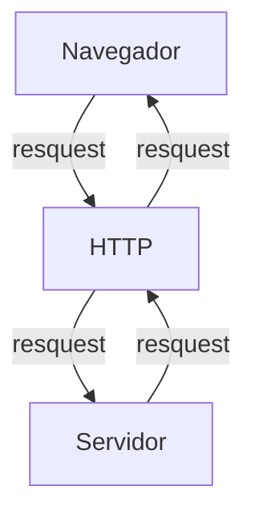
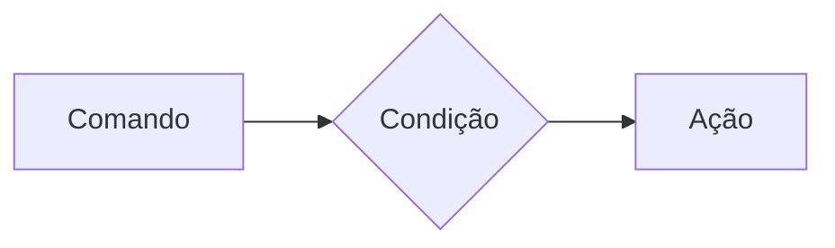

# Curso BackEnd - 225 - Técnico em Desenvolvimento de sistemas - SENAI
29/07/2026
---

Profº Diogo TB

Escola SENAI Americana

2º Semestre 2025

## Objetivos do Curso

- Desenvolver Aplicações web Server Side, utilizando a linguagem PHP;
- Aplicar Sintaxe Nativa PHP (Vanilla);
- Manipulação HTTP;
- Persistência de Dados;
- Segurança contra SQL Injection/CSRF;
- Refatoração em POO (Programação Orientada ao Objeto);
- Arquitetura MVC (Model, View, Controller);
- Utilização do FrameWork Laravel; 

Obs: framework - um conjunto de bibliotecas que oferecem uma solução completa para o desinvolvimento de alguma coisa.

## Cronograma do Semestre

Carga Horária: 1º Semestre 105h e 2º Semestre 120h

Duração: 20 Semanas 1º Semestre e 20 Semanas 2º Semestre

---

### Semana 1: Introdução ao BackEnd e Configuração do Ambiente PHP

#### O que é BackEnd?
 
 O back-end é a parte de uma aplicação que o usuário não vê, mas que faz tudo funcionar por trás das telas.

O Back-End é a parte de um sistema que funciona nos servidores, sendo responsável por executar a lógica da aplicação, processar informações e armazenar dados. 

Além disso, o BackEnd é responsável por atender ás solicitações do Frontend.

Sobre o mercado atual:o cenário é bom, mas mais exigente do que era. Quem conhece só o básico enfrenta mais concorrência. Quem alia backend sólido com IA aplicada, cloud e inglês está num patamar completamente diferente 
vagas internacionais remotas são uma realidade pra esse perfil.

O Backend é formado pelo servidor, banco de dados, lógica de programação com APIs e linguagens de programação/frameworks. Esses componentes trabalham juntos para processar dados, armazenar informações e garantir o funcionamento da aplicação.

# Para que serve
-Processar lógica de negócio: regras, cálculos, validações (ex: calcular frete, aplicar desconto, validar login)

-Gerenciar banco de dados: salvar, buscar, atualizar e deletar informações

-Autenticação e autorização: controlar quem pode acessar o quê (login, senhas, permissões)

-Fornecer APIs: criar "pontes" (endpoints) para o frontend ou outros sistemas consumirem dados

-Integração com serviços externos: pagamentos, e-mails, notificações, APIs de terceiros

-Segurança: proteger dados sensíveis, evitar ataques (SQL injection, XSS, etc.)

-Escalabilidade e performance: garantir que o sistema aguente muitos usuários ao mesmo tempo.


# Principais Tecnologias Linguagens de programação: 
 Ferramentas usadas para escrever o código do servidor, como Python, Node.js (JavaScript), Java e PHP.APIs: Os "caminhos" que permitem que o que você vê no celular converse com o servidor.


 Fintechs e Bancos
Segurança, transações, alta escala 

E-commerce
Catálogo, pedidos, pagamentos

Healthtechs
Prontuários, telemedicina

SaaS / Startups
Backend é o coração do produto

Logística
Rastreio, rotas, tempo real

Educação
Plataformas, conteúdo, usuários

#### O Ciclo de vida da Requisição HTTP

#### O que é HTTP?
**HTTP**, Hypertext Transfer Protocol, é um protocolo de comunicação utilizado para transferencia de informações na WWWW (World Wide Web) e em outros sistemas de redes.

O HTTP é a base para que o cliente e um servidor web troquem de informações. Ele permite a requisição e a respostas de recursos como, imagens, arquivos e textos.


---
## Como funciona na Prática o BackEnd

- **Ação do Usuário:** Envia uma solicitação pela UI (Interface do Usuário/ User Interface). 
> Exemplo de UI:
`-Tela do celular;`
`- Navegador da internet;`
`- Alexa;`
`-IOT.`
- **Enviar uma Requisição:** A UI transoforma a ação do Usuário em uma requisição HTTP.
-**O processamento BackEnd:** O código BackEnd recebe o pedido, válida os dados e decide o que fazer. 
>`Ex: Consultar uma informação no BD (Banco de Dados)`.

-**Respostas:** O servidor devolve o resultado para a UI. 
>`Ex: Um login autorizado, Confirmação de compra,..`

#### Tipos de Requisisão HTTP

Os tipos de requisição HTTP indicam a ação que o usuário deseja executar no servidor.
As principais são:

-**Get:**
> Pede dados de um lugar especifico do servidor. "Não faz alterações no servidor".

-**Delete:**
> Apaga um dado do servidor.

-**Post:**
> Envia dados novos para *criar* algo ou processar informações no servidor.

-**Put/Patch:**
> Modifica um dado já existente
---
>`Put: Muda os dados de forma integralmente/completa`

>`Patch: Muda os dados de forma parcial`
---
#### Iniciando o PHP 

**PHP** (HyperText PreProcessor) é uma linguagem de programação interpretada e open source, focada no desenvolvimento de sistemas para WEB, e pode ser usada junto com HTML para a criação de páginas web dinãmicas.

O PHP de fato é uma das linguagens de programação mais populares da atualidade. Ela permite que você crie aplicações WEB robustas, de uma maneira muito mais simplificada e direta. A linguagem tem diversos recursos que facilitam e aceleram o `processo de desenvolvimento de sites e sistemas para a web. E além do mais, ela ainda tem um ótimo ecossistema, uma excelente comunidade e um grande mercado de trabalho.

---
#### Instalando o PHP

- Fazer o Download do PHP (php.net)
- ZIP - NTS (Non Thread Safe) 8.5
- Descompactar o Arquivo do PHP na pasta C:\src\php (para descompactar, usar o ZIP7 --> Melhor) --> nunca salvar arquivos ou programas na raiz do sistema (C:)
- Adicionar a Pasta do PHP (C:\src\php) as variáveis de Ambiente do sistema (PATH)
- Verificar a instalação rodando o comando:
```bash
php --version
```
---
Para acessar a página PHP, usar o comando no terminal:
```Bash
php -S localhost:8080
```
---
#### Semana 2 - Varíáveis e constantes e operadores em PHP
#### Criando Minha Primeira Aplicação em PHP

>1.0 Antes de começar a Codar:

* Preparar meu VSCODE
* Criar um profile próprio para PHP
* Instalar Extensões Necessárias para transformar o meu VSCODE em uma IDE
    - PHP Intelephense -> **Permite a utilização de Snippets (atalhos de código)**
    - PHP Debug -> **Ajuda a encontrar erros de código**
    - PHP Cs Fixer -> **Formatação de códigco (identação)**
    - PHP Server -> **Ajuda na criação de um servidor local para PHP**
* Desabilitamos o PHP nativo do VSCODE (@bultinPHP)

>2.0 Hello World (Muito Importante!)

#### Estudo de Variáveis e Constantes em PHP

Declarar variáveis é alocar um espaço na memória que permite a inclusão e manipulação de dados.
 
 **Variáveis**

 - Devem ser declaradas usando um "$" antes do nome da variável
 - São não tipadas (Não precisa declarar o tipo dela na criação)
 - Podem ser String, Numéricas (Int e Float), Booleanas e Nulas. Não permite declaração de Undefined

 >REGRA DE OURO: Usar o "declare(Strict_types=1);" na primeira linha do arquivo -> blinda o sistema contra conflitos de tipos de variáveis

 **Constantes**
 - Não podem ser mudadas ou redeclaradas após a criação
 - Pode ser criada usando "const" ou "define"
 - Não permite interpolação

#### Estudo de Operadores

**Aritméticos**: São usados para realizar cálculos

| Operador | Nome | Exemplo | Resultado |
| - | - | - | - |
| + | Adição | 10+5 | 15 |
| - | Subtração | 10-5 | 5 |
| * | Multiplicação | 10*5 | 50
| / | Divisão | 10/5 | 2 | 
| % | Modulo(resto) |10%3| 1 (10 div 3 da 3, e sobra **1**)
|**| Expoente | 2**3| 8 (2 elevado a 3)

**Relacionais**: Permite o relacionamento entre dois ou mais valores, o resulado de uma operação é sempre uma booleana (Verdadeiro ou Falso).

| Operador | Significado | Exemplo | Resultado |
| - | - | - | - |
| > | Maior que | 18 > 18 | false |
| < | Menor que | 10 > 20 | true | 
| >= | Maior ou igual a | 18 > 18 | true |
| <= | Menor ou igual a | 10 <= 5 | false |
| ==| Comparação de valor | "10"==10 | true |
| === | Comparação estrita | "10"===10 | false |
|!=| Diferente | "10"!10| false |
| !== | Estritamente diferente | "10"!==10| true |

**Lógicos**:
Permite a combinação entre sentenças

- Operador AND (E) -> &&: para o resultado ser verdadeiro, todas as combinações precisam ser verdadeiras
    - true && true => true
    - true && false => false

- Operador OR (OU) -> ||: para o resultado ser verdadeiro, basta apenas uma condição ser verdadeira
    -false || true => true
    -false || false => false

- Operador NOT (NÃO) => !: Inverte a lógica da operação
    - !true => false
    - !false => true

--- 
### Semana 3  Estrutura de dados (Condicionais e repetição)

- **Conteúdo**:
 Estrutura 
 operdadores ternários ->`if`,`else`,`elseif` 
substituto do switch/case -> `match` 
loops -> `for`,`while`,`do-while`,`forach`

## Estruturas de controle de dados ajudam no processo de automatização em programas e sistemas

### Condiciomais (IF,ELSE,ELSEIF)

**Formas de uso**

- uso do `if`apenas:
Exemplo: aplicar desconto de 10% em compras acima de 100 reais.


---
```php
if($valorCompra > 100){
    $valorFinal = $valorCompra * 0.9;
}
```

- Uso do `if` e do `else`
Exemplo: Aplicar um desconto de 10% para compras acima de 100 reais e 5% paraa as demais compras
 
 ```mermaid
 graph LR
 A[Comando] --> B{Condição}
 B --> |true| C[Ação 1]
 B --> |false| D[Ação 2]
 ``` 
 
 ```php
 if ($valorCompra > 100){
    $valorFinal = $valorCompra * 0.9;
 } else{
    $valorFinaç = $valorCompra * 0.95;
 }
 ```